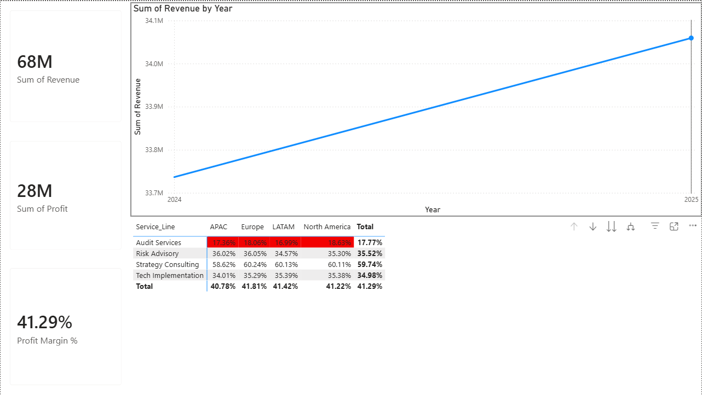

# 📈 Interactive Sales & Operations Dashboard

## 📌 Business Context
Designed a Business Intelligence solution to analyze profitability across 4 global regions. The goal was to move beyond static reporting and identify **margin leakage** (profit loss) in specific service lines.

## 📸 Dashboard Preview

## 🔍 Key Insights & Findings
* **Critical Issue Identified:** "Audit Services" in the APAC region are operating at a **<18% margin** (flagged RED in dashboard), significantly below the corporate target of 30%.
* **Growth Trend:** "Strategy Consulting" shows a consistent **15% Quarter-over-Quarter growth**, suggesting a need to reallocate resources to this vertical.
* **Operational Efficiency:** Automated the aggregation of 1,500+ transaction records, reducing manual Excel reporting time by **40%**.

## 🛠️ Technical Implementation
1.  **Data Engineering (Python):** * Generated synthetic transaction data using `pandas` and `numpy`.
    * Modeled complex variables like regional pricing variance and service-specific cost structures.
2.  **Visualization (Power BI):**
    * **DAX Measures:** Calculated dynamic `Profit Margin %` = `SUM(Profit) / SUM(Revenue)`.
    * **Conditional Formatting:** Applied logic (`If Margin < 20% then RED`) to instantly highlight underperforming sectors.
    * **Trend Analysis:** Created time-series visualizations to forecast revenue trajectory.

## 🚀 How to Run
1.  **Data Generation:** Run `python generate_data.py` to create the dataset.
2.  **Visualization:** Open the `.pbix` file in Power BI Desktop to interact with the model.
